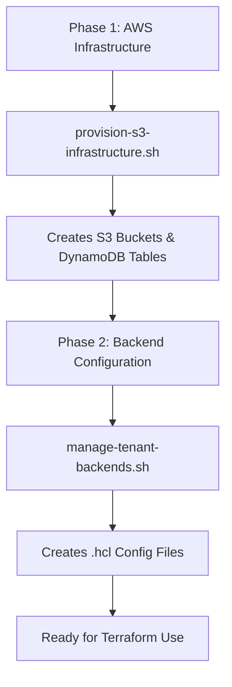

# Script Synchronization Guide

## 🎯 **Overview**

This guide explains how `provision-s3-infrastructure.sh` and `manage-tenant-backends.sh` work together to provide a complete multi-tenant backend solution.

## 🔄 **Script Relationships**

### **Two-Phase Architecture**



### **Function Separation**

| **Script** | **Purpose** | **Creates** | **AWS Resources** |
|------------|-------------|-------------|-------------------|
| `provision-s3-infrastructure.sh` | 🏗️ **Infrastructure** | S3 Buckets, DynamoDB Tables | ✅ **YES** |
| `manage-tenant-backends.sh` | 📋 **Configuration** | .hcl Backend Files | ❌ **NO** |

## 🔧 **Synchronization Solution**

### **Shared Configuration (`shared-config.sh`)**

Both scripts now use unified naming conventions:

```bash
# Unified bucket naming
generate_bucket_name() {
    echo "${project_name}-terraform-state-${environment}"
}

# Unified DynamoDB naming  
generate_dynamodb_table_name() {
    local region_short=$(echo "$region" | sed 's/-[0-9]*$//')
    echo "terraform-locks-${region_short}"
}
```

### **Automatic Validation**

The `manage-tenant-backends.sh` script now automatically:

1. ✅ **Checks if AWS infrastructure exists**
2. ✅ **Validates S3 bucket accessibility**
3. ✅ **Confirms DynamoDB table availability**
4. ✅ **Offers to run provisioning if missing**

## 🚀 **Correct Usage Workflow**

### **Step 1: Provision AWS Infrastructure**
```bash
# Creates actual S3 buckets and DynamoDB tables in AWS
./scripts/provision-s3-infrastructure.sh \
  --region us-west-2 \
  --environment production \
  --project-name myproject \
  --company-name "My Company"
```

**What this creates:**
- 🪣 S3 Bucket: `myproject-terraform-state-production`
- 🗃️ DynamoDB Table: `terraform-locks-us-west`
- 📊 CloudWatch Alarms
- 🔐 Encryption & Security Settings

### **Step 2: Create Tenant Backend Configurations**
```bash
# Creates .hcl files that reference the AWS resources from Step 1
./scripts/manage-tenant-backends.sh \
  --region us-west-2 \
  --environment production \
  --project-name myproject \
  --tenant mtn-ghana \
  --create-tenant
```

**What this creates:**
- 📋 `foundation.hcl` - VPC, networking backend config
- 📋 `platform.hcl` - EKS, RDS backend config  
- 📋 `observability.hcl` - Monitoring backend config
- 📋 `shared-services.hcl` - DNS, secrets backend config
- 📋 `backend.hcl` - Default backend config

### **Step 3: Verify Synchronization**
```bash
# Check if everything is properly synchronized
./scripts/manage-tenant-backends.sh \
  --region us-west-2 \
  --environment production \
  --project-name myproject \
  --check-sync
```

## 🔍 **Sync Verification Commands**

### **Check Infrastructure Status**
```bash
# Verify AWS infrastructure exists and is accessible
./scripts/manage-tenant-backends.sh \
  --region us-west-2 \
  --environment production \
  --project-name myproject \
  --check-sync
```

**Expected Output:**
```
╭─ Infrastructure Readiness Check
[INFO] 🔍 Validating AWS infrastructure exists...
[SUCCESS] ✅ AWS infrastructure validated
[INFO]    🪣 S3 Bucket: myproject-terraform-state-production
[INFO]    🗃️  DynamoDB Table: terraform-locks-us-west

[INFO] 📋 Infrastructure Configuration:
   🏷️  Project Name:    myproject
   🌍 Region:          us-west-2
   🏗️  Environment:     production
   🪣 S3 Bucket:       myproject-terraform-state-production
   🗃️  DynamoDB Table:  terraform-locks-us-west

[SUCCESS] ✅ AWS infrastructure is provisioned
[SUCCESS] ✅ Found 1 tenant backend(s) configured
```

### **View All Backend Paths**
```bash
# See all backend configurations with consistent naming
./scripts/manage-tenant-backends.sh --show-all-paths
```

## ⚠️ **Common Sync Issues & Solutions**

### **Issue 1: AWS Infrastructure Missing**
```bash
# ERROR: S3 bucket not found: myproject-terraform-state-production
```

**Solution:**
```bash
# Run infrastructure provisioning first
./scripts/provision-s3-infrastructure.sh \
  --region us-west-2 \
  --environment production \
  --project-name myproject
```

### **Issue 2: Naming Inconsistencies**
```bash
# ERROR: Backend configs reference wrong bucket names
```

**Solution:**
```bash
# Use consistent project names across both scripts
PROJECT_NAME="myproject"

# Infrastructure
./scripts/provision-s3-infrastructure.sh \
  --project-name $PROJECT_NAME \
  --region us-west-2 \
  --environment production

# Backend configs  
./scripts/manage-tenant-backends.sh \
  --project-name $PROJECT_NAME \
  --region us-west-2 \
  --environment production \
  --tenant client-a \
  --create-tenant
```

### **Issue 3: Wrong DynamoDB Table Names**
**Fixed automatically** - Both scripts now use `shared-config.sh` for consistent naming.

## 🎯 **Best Practices**

### **1. Use Consistent Project Names**
```bash
# Define once, use everywhere
PROJECT_NAME="mycompany"
REGION="us-west-2"
ENVIRONMENT="production"

# Infrastructure
./scripts/provision-s3-infrastructure.sh \
  --project-name $PROJECT_NAME \
  --region $REGION \
  --environment $ENVIRONMENT

# Backend configs
./scripts/manage-tenant-backends.sh \
  --project-name $PROJECT_NAME \
  --region $REGION \
  --environment $ENVIRONMENT \
  --tenant client-a \
  --create-tenant
```

### **2. Always Verify Sync Status**
```bash
# After any changes, verify sync
./scripts/manage-tenant-backends.sh \
  --project-name $PROJECT_NAME \
  --region $REGION \
  --environment $ENVIRONMENT \
  --check-sync
```

### **3. Follow the Sequence**
1. ✅ **Infrastructure first** - `provision-s3-infrastructure.sh`
2. ✅ **Backend configs second** - `manage-tenant-backends.sh`
3. ✅ **Verify sync third** - `--check-sync`

## 📋 **Configuration Files Generated**

### **Backend Configuration Example**
```hcl
# foundation.hcl (generated by manage-tenant-backends.sh)
bucket         = "myproject-terraform-state-production"    # ← From shared config
key            = "tenants/mtn-ghana/layers/foundation/production/terraform.tfstate"
region         = "us-west-2"
dynamodb_table = "terraform-locks-us-west"                # ← From shared config  
encrypt        = true
```

### **Infrastructure Resources (created by provision-s3-infrastructure.sh)**
```yaml
AWS Resources Created:
- S3 Bucket: myproject-terraform-state-production
  - Versioning: Enabled
  - Encryption: AES256/KMS
  - Public Access: Blocked
  
- DynamoDB Table: terraform-locks-us-west
  - Billing: On-Demand
  - Encryption: Enabled
  - Point-in-time Recovery: Enabled
```

## 🚨 **Troubleshooting**

### **Automatic Infrastructure Check**
When you run `manage-tenant-backends.sh`, it now automatically checks if the required AWS infrastructure exists:

```bash
╭─ Infrastructure Readiness Check
[WARNING] ⚠️  Required AWS infrastructure is missing!

[INFO] 🚀 To fix this, run:
   ./scripts/provision-s3-infrastructure.sh \
     --region us-west-2 \
     --environment production \
     --project-name myproject

Would you like to run the provisioning script now? (y/N)
```

### **Manual Verification**
```bash
# Check if bucket exists
aws s3api head-bucket --bucket myproject-terraform-state-production --region us-west-2

# Check if DynamoDB table exists  
aws dynamodb describe-table --table-name terraform-locks-us-west --region us-west-2
```

## 🎉 **Summary**

### **Before (Inconsistent)**
- ❌ Different naming conventions
- ❌ Manual sync checking required
- ❌ Easy to create mismatched configs

### **After (Synchronized)**  
- ✅ **Unified naming** via `shared-config.sh`
- ✅ **Automatic validation** built-in
- ✅ **Clear workflow** with error handling
- ✅ **Infrastructure checks** before config creation
- ✅ **Sync verification** commands available

### **Key Commands to Remember**

```bash
# 1. Create AWS infrastructure
./scripts/provision-s3-infrastructure.sh --region us-west-2 --environment production --project-name myproject

# 2. Create tenant backend configurations  
./scripts/manage-tenant-backends.sh --region us-west-2 --environment production --project-name myproject --tenant client-a --create-tenant

# 3. Verify everything is synchronized
./scripts/manage-tenant-backends.sh --region us-west-2 --environment production --project-name myproject --check-sync

# 4. View all backend paths
./scripts/manage-tenant-backends.sh --show-all-paths
```

The scripts are now **perfectly synchronized** and will guide you through the correct workflow! 🚀